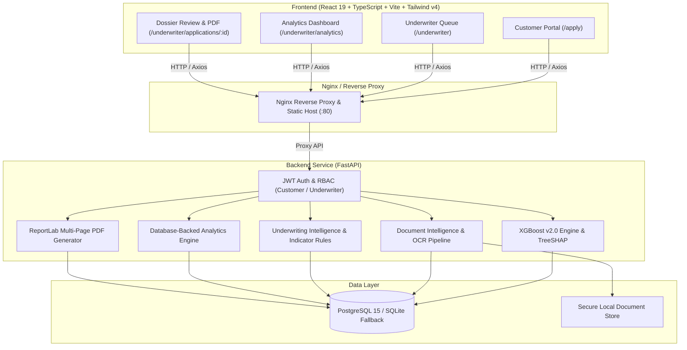

# InsureAI — AI-Powered Health Underwriting & Decision Support Platform

InsureAI is an enterprise-grade AI-powered health insurance underwriting platform that pairs actuarial machine learning with document intelligence, explainability, operations analytics, and strict human-in-the-loop governance.

---

## 📑 Table of Contents
- [Architecture & System Overview](#architecture--system-overview)
- [Technology Stack](#technology-stack)
- [Core Capabilities (Phases 1–9)](#core-capabilities-phases-19)
  - [1. Customer Application & Self-Service](#1-customer-application--self-service)
  - [2. Actuarial Machine Learning (XGBoost v2.0)](#2-actuarial-machine-learning-xgboost-v20)
  - [3. TreeSHAP Explainability Engine](#3-treeshap-explainability-engine)
  - [4. Relational Persistence & Dual-Engine Fallback](#4-relational-persistence--dual-engine-fallback)
  - [5. JWT Authentication & Role-Based Authorization](#5-jwt-authentication--role-based-authorization)
  - [6. Underwriter Dashboard & Review Queue](#6-underwriter-dashboard--review-queue)
  - [7. Document Intelligence & OCR Consistency Checking](#7-document-intelligence--ocr-consistency-checking)
  - [8. Underwriting Intelligence & Narrative Synthesis](#8-underwriting-intelligence--narrative-synthesis)
  - [9. Operations Analytics, PDF Reporting & Containerization](#9-operations-analytics-pdf-reporting--containerization)
- [Human-in-the-Loop Governance](#human-in-the-loop-governance)
- [Quickstart: Local Development](#quickstart-local-development)
- [Deployment: Docker Compose](#deployment-docker-compose)
- [API Reference & Health Endpoints](#api-reference--health-endpoints)
- [Automated Testing & Quality Verification](#automated-testing--quality-verification)

---

## Architecture & System Overview



---

## Technology Stack

| Layer | Technologies |
|---|---|
| **Frontend** | React 19, TypeScript, Vite 8, Tailwind CSS v4, Axios, React Router v7, Lucide React, Recharts |
| **Backend** | Python 3.11/3.14, FastAPI, Pydantic v2, Uvicorn, SQLAlchemy 2.0, Alembic |
| **Machine Learning** | XGBoost 2.0 (Champion Regressor), SHAP (TreeExplainer), Scikit-Learn |
| **Document Processing** | PyPDF, pdfplumber, pytesseract (OCR with native fallback), ReportLab (PDF generation) |
| **Database** | PostgreSQL 15 (Production), SQLite with automatic zero-config development fallback |
| **Security & Auth** | JWT (`HS256`), bcrypt password hashing, role-based authorization (`CUSTOMER`, `UNDERWRITER`) |
| **DevOps & CI/CD** | Docker, Docker Compose, Nginx, GitHub Actions (`ci.yml`) |

---

## Core Capabilities (Phases 1–9)

### 1. Customer Application & Self-Service
- Multi-step customer onboarding capturing actuarial inputs (age, biological sex, BMI, dependents, smoking habits, geographic region).
- Immediate real-time validation and localized currency formatting.

### 2. Actuarial Machine Learning (XGBoost v2.0)
- Benchmarked rigorously against Linear Regression, Random Forest, and Gradient Boosting.
- Champion **XGBoost Regressor** achieved test MAE ≈ ₹2,404.74 and $R^2 \approx 0.8791$.
- Generates actuarial baseline comparison, calibrated loss cost, and risk tiers (Low, Medium, High).

### 3. TreeSHAP Explainability Engine
- Integrated native TreeSHAP explainer evaluating exact local feature attributions per applicant.
- Answers the core actuarial question: *"Why did the model predict this specific insurance premium?"*
- Separates factors into cost-increasing drivers (e.g. smoking habits, elevated BMI) and discount factors (e.g. young age, favorable region).

### 4. Relational Persistence & Dual-Engine Fallback
- Clean relational schema across `users`, `applications`, `predictions`, `documents`, and `underwriter_decisions`.
- Automatic transparent fallback from PostgreSQL to SQLite (`insureai.db`) when external database instances are unavailable.

### 5. JWT Authentication & Role-Based Authorization
- Cryptographic password hashing using `bcrypt`.
- Stateles JWT tokens with role claims enforcing strict backend RBAC:
  - `CUSTOMER`: Limited strictly to viewing and submitting own applications.
  - `UNDERWRITER`: Authorized to inspect all queues, run predictions, analyze portfolios, download reports, and record decisions.
- Cross-tenant isolation guarantees customers cannot access another user's dossiers or documents.

### 6. Underwriter Dashboard & Review Queue
- Live filterable queue supporting multi-dimensional triage (Status, Review Priority, Risk Tier, Smoker flag, Search).
- Real-time status progression (`PENDING_REVIEW` -> `REVIEW_REQUIRED` -> `APPROVED` / `REJECTED`).
- Decision audit history tracking timestamps, notes, and underwriter identity.

### 7. Document Intelligence & OCR Consistency Checking
- Multi-format ingestion supporting PDF, PNG, and JPEG documents.
- Multi-layer extraction using embedded text parsing with automated OCR fallback.
- Actuarial consistency engine verifying disclosed application parameters against extracted document text (e.g. detecting smoking discrepancies in medical records or age mismatches on PAN cards).

### 8. Underwriting Intelligence & Narrative Synthesis
- Dynamic rule evaluation engine assessing clinical and actuarial indicators (BMI classifications, smoking confirmation, document gaps).
- Deterministic review priority assignment: `LOW`, `MEDIUM`, `HIGH`, or `CRITICAL`.
- Natural-language narrative synthesis summarizing dossier findings for the underwriter.

### 9. Operations Analytics, PDF Reporting & Containerization
- **Operations Analytics Dashboard** (`/underwriter/analytics`):
  - 8 real-time KPI metrics (Total Applications, Approval Rate %, Average Predicted Premium, Critical Review Queue, Pending, Approved, Rejected, Review Required).
  - Interactive Recharts visualizations: Monthly Application Volume, Risk Tier Distribution donut chart, Average Premium Trends, and Underwriting Status breakdown.
  - Zero fabricated metrics — 100% computed from real SQL database records.
- **Professional Multi-Page PDF Underwriting Report**:
  - Dynamically rendered via ReportLab at `/applications/{id}/underwriting-report`.
  - Includes Applicant Profile, XGBoost v2.0 Assessment, TreeSHAP Drivers (+/-), Phase 7 Document Intelligence, Phase 8 Risk Indicators & Narrative, Decision Audit Trail, and Masked PII (`ABCDE****F`, `**** **** 9012`).
  - Strict human-in-the-loop governance disclaimer on every document.
- **Production Containerization**:
  - Multi-stage Docker build for frontend (Vite -> Nginx alpine).
  - Production Python 3.11 slim backend image with healthchecks.
  - Full-stack `docker-compose.yml` orchestrating PostgreSQL, Backend, and Frontend.
  - GitHub Actions CI pipeline running tests, linting, and build validation.

---

## Human-in-the-Loop Governance

> [!IMPORTANT]
> **Regulatory and Actuarial Safeguard:**
> InsureAI operates strictly as a **decision-support platform**. Machine learning predictions, SHAP feature attributions, and document consistency verifications do NOT make binding underwriting approvals, rejections, or coverage modifications autonomously. Final underwriting determination rests exclusively with licensed, authorized human underwriters.

---

## Quickstart: Local Development

### Prerequisites
- Python 3.10+
- Node.js 18+ and npm
- Git

### 1. Backend Setup
```bash
cd backend
python -m venv venv

# Windows
venv\Scripts\activate
# macOS/Linux
source venv/bin/activate

pip install -r requirements.txt
cp .env.example .env

# Run FastAPI server
uvicorn main:app --reload --host 127.0.0.1 --port 8000
```
API Documentation will be available at `http://127.0.0.1:8000/docs`.

### 2. Frontend Setup
```bash
cd frontend
npm install
npm run dev
```
Frontend will be accessible at `http://localhost:5173`.

### Default Credentials
- **Lead Underwriter**: `underwriter@insureai.com` / `Underwriter@123`
- **Customer Self-Registration**: Register at `/register`

---

## Deployment: Docker Compose

To deploy the entire production stack (PostgreSQL + FastAPI + Nginx/React):

```bash
# 1. Clone the repository
git clone https://github.com/adhithyaaay/InsureAI.git
cd InsureAI

# 2. Configure environment variables
cp .env.example .env

# 3. Build and launch containers
docker compose up -d --build

# 4. Verify running services
docker compose ps
```

Services will be exposed on:
- **Frontend / Application UI**: `http://localhost` (Port 80)
- **Backend API**: `http://localhost:8000`
- **PostgreSQL**: `localhost:5432`

---

## API Reference & Health Endpoints

### Observability & Health Probes
- `GET /health` — Liveness probe (`{"status": "ok"}`)
- `GET /health/db` — Readiness probe verifying active database connection

### Analytics Endpoints (Underwriter Role Required)
- `GET /analytics/dashboard` — High-level KPI operational statistics
- `GET /analytics/risk-distribution` — Risk tier breakdown (Low, Medium, High)
- `GET /analytics/monthly` — Application volumes grouped by month
- `GET /analytics/premium-trend` — Average predicted premiums grouped by month

### Reports (Underwriter Role Required)
- `GET /applications/{id}/underwriting-report` — Streams complete multi-page PDF assessment

---

## Automated Testing & Quality Verification

Run the automated test suites using the backend Python environment:

```bash
# Phase 9: Analytics, PDF Reports & Health Probes
python scratch/test_phase9_analytics_reports.py

# Phase 8: Underwriting Intelligence & Review Priority
python scratch/test_phase8_underwriting_intelligence.py

# Phase 7: Document Intelligence & OCR Verification
python scratch/test_phase7_document_intelligence.py

# Phase 6: Underwriter Queue & Decision System
python scratch/test_phase6_underwriter.py

# Phase 5: Authentication & Cross-Tenant RBAC
python scratch/test_phase5_auth.py

# Frontend TypeScript Verification & Production Build
cd frontend
npm run typecheck
npm run build
```

---

## License
Proprietary & Confidential — InsureAI Actuarial Systems.
